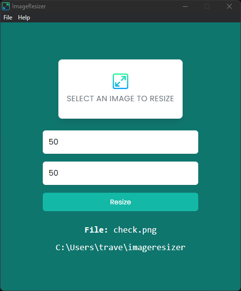

# Image Resizer

Electron application that allows you to select an image and easily change the width and/or height.

<div style="display: flex; justify-content: center">

</div>

## Usage

Install dependencies:

```bash

npm install
```

Run:

```bash
npm start
```

You can also use `Electronmon` to constantly run and not have to reload after making changes

```bash
npx electronmon .
```

## Packaging

There are multiple ways to package Electron apps. I would suggest [Electron Forge](https://www.electronforge.io/). I did not implement any packaging into this app.

## Developer Mode

If your `NODE_ENV` is set to `development` then you will have the dev tools enabled and available in the menu bar. It will also open them by default.

When set to `production`, the dev tools will not be available.